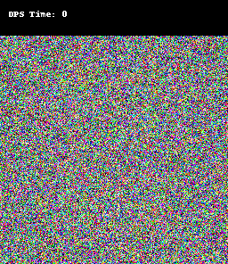
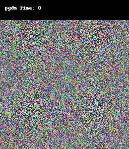
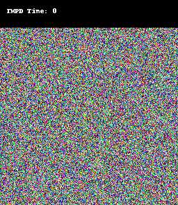
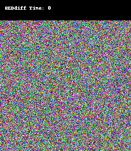

# Code for MSc Project 2024

## Abstract
> Flow-based generative models trained with simulation-free approaches have become strong contenders to diffusion models in various tasks. However, training-free guidance methods for controlled generation for flow models are not as well developed compared to diffusion. In this work, we propose Tweedie Moment Projected Flows (TMPF) model for zero-shot controlled generation using a pre-trained flow model. We demonstrate the effectiveness of the proposed method on linear inverse problems on both synthetic and real-world data such as high-resolution images. 

This repository is based the Rectified Flow implementation [(Liu et al. 2023)](https://arxiv.org/abs/2209.03003).

## Results on AFHQ
Some qualitative results are shown below on the AFHQ-cats dataset [(Choi et al. 2019)](https://arxiv.org/abs/1912.01865):  

<!-- 
Some qualitative results are shown below on the AFHQ-cats dataset [(Choi et al. 2019)](https://arxiv.org/abs/1912.01865):
| Guided Samplers    |
| ------ |

| DPS [(Chung et al. 2023)](https://arxiv.org/abs/2209.14687) |  

| PiGDM [(Song et al. 2023)](https://openreview.net/forum?id=9_gsMA8MRKQ)  | 

| TMPD [(Boys et al. 2023)](https://arxiv.org/abs/2310.06721)  | 

| REDdiff [(Mardani et al. 2023)](https://arxiv.org/abs/2305.04391)|  -->

<!-- | Guided Samplers    |
| ------ |

| DPS | 

| PiGDM  | 

| TMPD   | 

| REDdiff|  -->

<!-- DPS
   

PiGDM
   

TMPD
 

REDdiff
  -->
